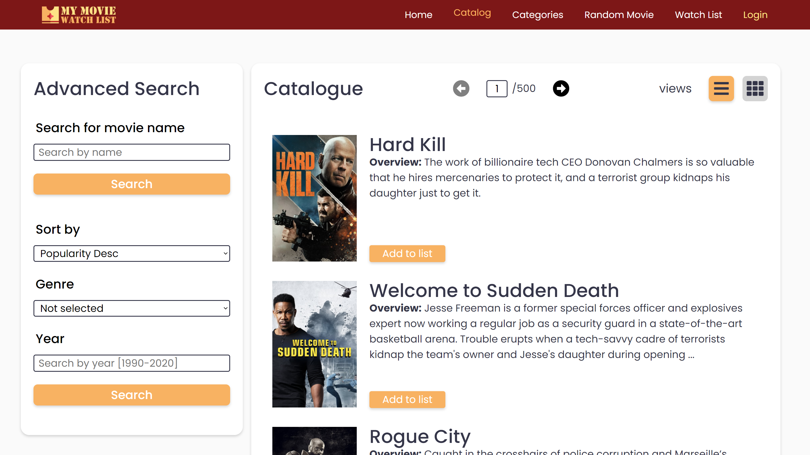
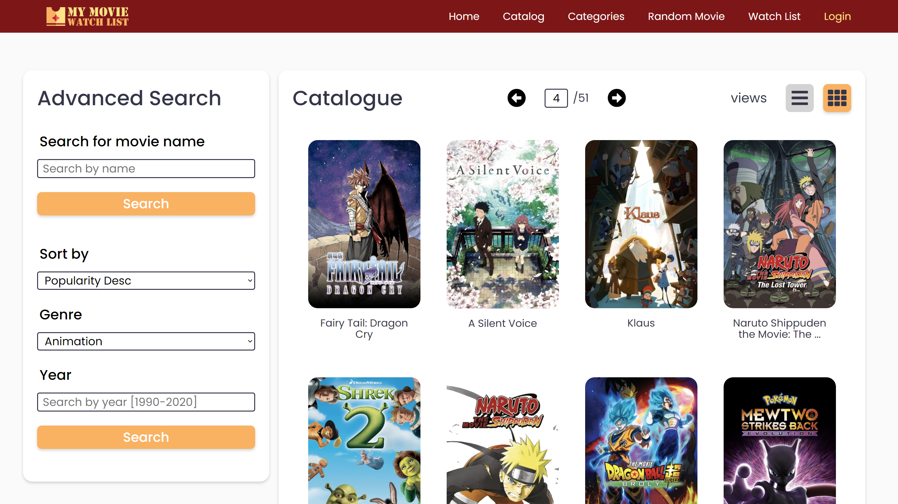
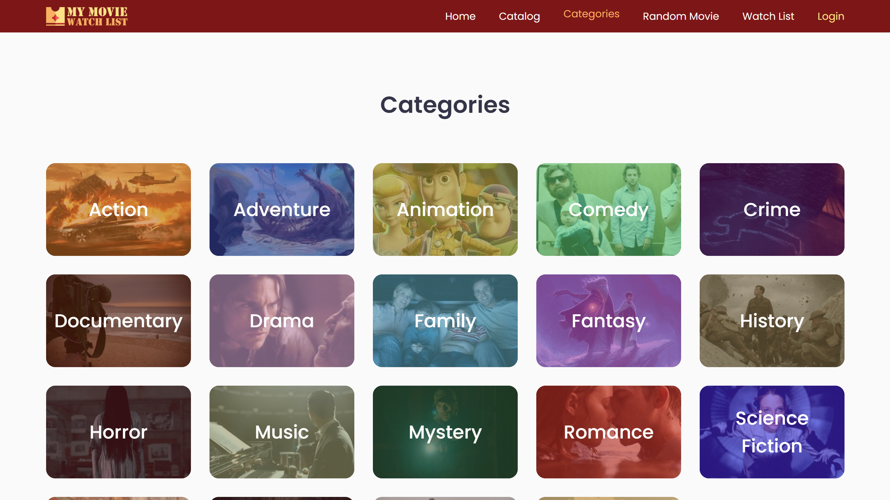
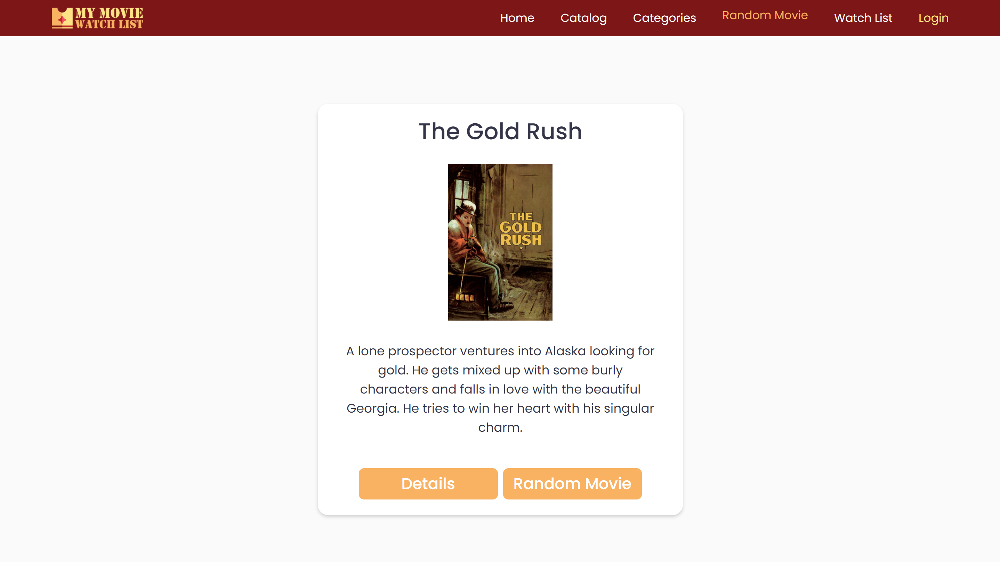
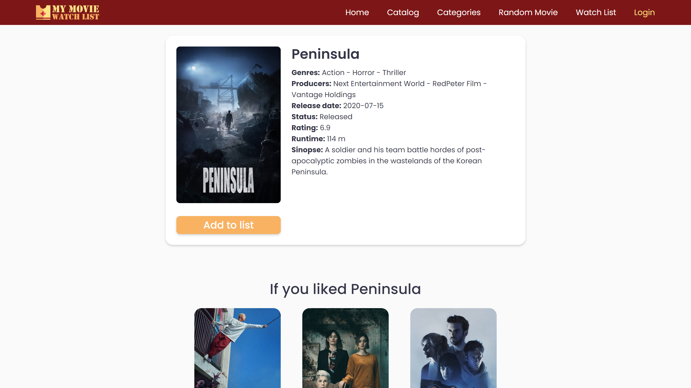

# MyWatchedMovieList


Similar to TV Time, MyAnimeList, among others, MyWatchedMovieList is a application that allows you to discover movies, see more information about them and add them to you watch list if watched.

## Features

* Banner movies
* Featured movies
* Catalog with advanced search and different views
* Details about the movies
  * Recommended movies based on the movie and in one of the movie genres
* Watch list page
  * Possibility to add/remove to/from list on movie hover
* Random movie
* Categories Page

## Next features to add

* Login/Sign up using firebase
* Start using firebase instead of local storage
* Tests

## Technologies used

* Vue.js 2
* Typescript
* CSS3
* HTML5

## Try it

rodrigoqueiros.github.io/MyWatchedMovieList-Server

## Project setup

### Git clone
```
git clone https://github.com/RodrigoQueiros/Owl---PW1-Project.git
```

### NPM
```
npm install
```

### Compiles and hot-reloads for development
```
npm run serve
```

### Compiles and minifies for production
```
npm run build
```

## API used

https://www.themoviedb.org/

## Screenshots 

### Home page


### Catalog page


### Catalog search page


### Categories page


### Random movie page


### Details page


### Watchlist page


### Watchlist 2 page


### Login page


## Author

* **Rodrigo Queirós** - [RodrigoQueiros](https://github.com/RodrigoQueiros)

